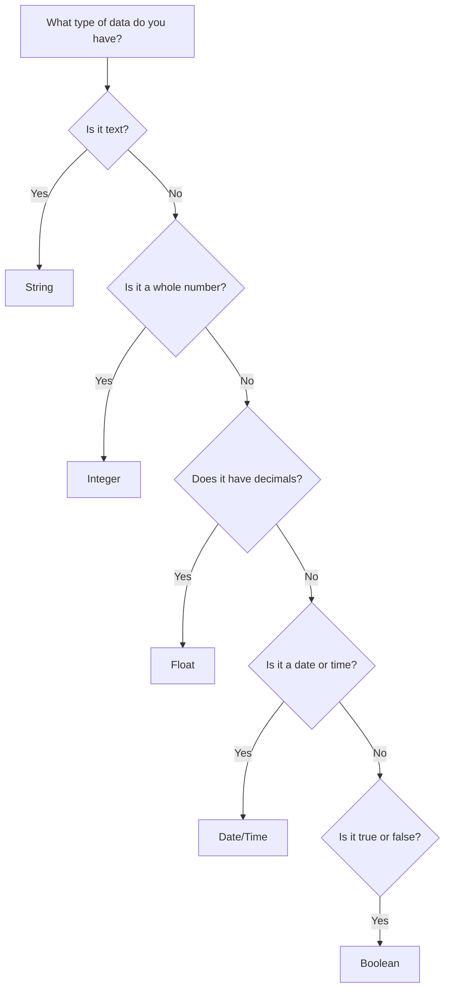

# 1.2.3 Data Types

> [!abstract] Introduction
> All data has a property called a data type, which tells applications how to treat it. The operations that can be performed on data are defined by its type. Understanding data types is essential for effective data analysis, storage, and manipulation.

---

## What Are Data Types?

A data type is an attribute that defines the kind of value a variable can hold. It determines:

- What operations can be performed on the data
- How much memory is allocated to store the data
- How the data is interpreted by applications and programming languages

---

## Common Data Types

### 1. String

A string is data that is considered text. It is composed of letters, numbers, and symbols that will not be used for calculations.

#### Key Characteristics

- **Textual**: Contains alphabetic characters, numbers, and symbols
- **Non-numeric**: Not intended for mathematical operations
- **Flexible**: Can include spaces, line breaks, and special characters

#### Examples

| Example | Description |
|:---|:---|
| `"Hello World"` | Simple text greeting |
| `"Room 140"` | Alphanumeric identifier |
| `"Cisco Networking Academy"` | Organization name |
| `"123 Main Street"` | Address with numbers as text |
| `"user@email.com"` | Email address |

#### Common Operations

- Concatenation (joining strings together)
- Length calculation
- Search and replace
- Substring extraction
- Case conversion

---

### 2. Integer

An integer is a whole number that does not include decimals or fractions. Integers are used for ordering, classifying, and basic counting.

#### Key Characteristics

- **Whole numbers**: No decimal points or fractional parts
- **Discrete**: Represents countable quantities
- **Signed or unsigned**: Can be positive, negative, or zero

#### Examples

| Example | Description |
|:---|:---|
| `1` | Basic counting |
| `125` | Quantity or count |
| `300` | Large whole number |
| `-66` | Negative integer |
| `0` | Zero value |

#### Common Operations

- Arithmetic (addition, subtraction, multiplication, division)
- Comparison (greater than, less than, equal to)
- Counting and indexing
- Ordering and sorting

#### Common Use Cases

- Counting transactions
- Number of employees
- Product quantities
- Age in years
- Order numbers

---

### 3. Float (Floating Point)

A float is a number that includes decimals. These are among the most common data types used in statistical analysis.

#### Key Characteristics

- **Decimal numbers**: Includes fractional parts
- **Continuous**: Can represent values with high precision
- **Approximate**: May have small rounding errors due to binary representation

#### Examples

| Example | Description |
|:---|:---|
| `0.0003` | Very small decimal value |
| `-9.5` | Negative decimal |
| `3.14159` | Pi approximation |
| `98.6` | Average body temperature |
| `27.15` | Price with cents |

#### Common Operations

- Mathematical calculations
- Statistical analysis
- Scientific computations
- Measurement representation

#### Common Use Cases

- Average calculations
- Temperature measurements
- Currency and pricing
- Scientific data
- Distance and weight measurements

---

### 4. Date and Time

Date and time data types store a specific instant in time, expressed as a date, time, or both. Their primary function is to track changes in datasets over time.

#### Key Characteristics

- **Temporal**: Represents specific moments or intervals
- **Multiple formats**: Can be stored in various formats (YYYY-MM-DD, MM/DD/YYYY, etc.)
- **Calculable**: Supports date arithmetic (adding days, calculating differences)

#### Common Formats

| Format | Example |
|:---|:---|
| YYYY-MM-DD | `2026-06-26` |
| MM/DD/YYYY | `06/26/2026` |
| DD-MM-YYYY | `26-06-2026` |
| ISO 8601 | `2026-06-26T14:30:00Z` |
| Unix Timestamp | `1719402000` |

#### Common Operations

- Date difference calculations
- Date formatting and parsing
- Time zone conversions
- Chronological sorting

#### Common Use Cases

- Transaction records
- System logs
- Employee hire dates
- Sales reporting by period
- Tracking data changes over time

---

### 5. Boolean

Boolean data represents values that are treated as either true or false. Boolean expressions are used for conditional logic and decision-making.

#### Key Characteristics

- **Binary**: Only two possible values: true or false
- **Logical**: Used for conditions and comparisons
- **Foundation of programming logic**: Drives decision-making in code

#### Examples

| Example | Boolean Value |
|:---|:---|
| `15 > 30` | False |
| `10 == 10` | True |
| `Is customer active?` | True or False |
| `Temperature > 100` | True or False |
| `User is logged in` | True or False |

#### Common Operations

- Logical operations (AND, OR, NOT)
- Conditional checks (if/else statements)
- Comparison expressions
- Filtering and selection

#### Common Use Cases

- Feature toggles (enabled/disabled)
- User authentication states
- Data validation checks
- Conditional formatting
- Filter criteria in queries

---

## Data Types Comparison Summary

| Data Type | Description | Example | Common Use |
|:---|:---|:---|:---|
| **String** | Text data, letters, numbers, symbols | `"Hello World"` | Names, addresses, descriptions |
| **Integer** | Whole numbers, no decimals | `125` | Counting, indexing, ordering |
| **Float** | Numbers with decimals | `3.14159` | Averages, measurements, prices |
| **Date/Time** | Specific instants in time | `2026-06-26` | Timestamps, logs, scheduling |
| **Boolean** | True or false values | `True` / `False` | Conditions, flags, logic |

---

## Quick Reference: Selecting the Right Data Type

| If You Need To... | Use This Data Type |
|:---|:---|
| Store text or alphanumeric labels | String |
| Count or index whole items | Integer |
| Perform calculations with precision | Float |
| Track changes over time | Date/Time |
| Store logical conditions or flags | Boolean |

---

> [!tip] Key Takeaway
> Data types are the foundation of how data is stored, processed, and interpreted. Choosing the correct data type ensures that data is handled properly and that operations produce expected results. A thorough understanding of data types is essential for any data professional.

