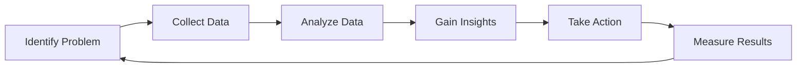

# 1.3.1 Data Analysis for Business Ideas

> [!abstract] Introduction
> Our connected world is complex. This complexity generates a massive quantity of data. Data science enables businesses to better understand the impact of their products or services, adjust their processes and goals, and provide customers with better products faster. It has a huge impact on business success and the lives of employees.

---

## The Impact of Data Science

Data science transforms how organizations operate and make decisions.

### Business Benefits

| Benefit | Description |
|:---|:---|
| **Better Understanding** | Gain insights into how products and services perform in the market |
| **Process Optimization** | Adjust internal processes and goals based on data-driven insights |
| **Faster Delivery** | Provide customers with better products more quickly |
| **Improved Decision-Making** | Make informed choices backed by evidence rather than intuition |
| **Employee Empowerment** | Equip employees with data-driven tools and insights |

### Key Areas of Impact

- **Customer Experience**: Personalization and improved service delivery
- **Operational Efficiency**: Streamlined processes and reduced costs
- **Innovation**: New products, services, and business models
- **Risk Management**: Identifying and mitigating potential threats
- **Competitive Advantage**: Staying ahead in a data-driven marketplace

---

## Types of Data Analysis

There are multiple types of analysis that can drive innovation, improve efficiency, and mitigate risks. The type of analysis used depends on the problem to be solved or the question to be answered.

### Common Types of Analysis

| Analysis Type | Purpose | Example |
|:---|:---|:---|
| **Trend Analysis** | Identify patterns and changes over time | Tracking Key Performance Indicators (KPIs) to understand business performance |
| **Descriptive Analysis** | Summarize what has happened | Monthly sales reports, customer demographics |
| **Diagnostic Analysis** | Understand why something happened | Investigating why sales declined in a specific region |
| **Predictive Analysis** | Forecast what might happen | Predicting future customer demand |
| **Prescriptive Analysis** | Recommend actions to take | Optimizing pricing strategies based on data |

### Trend Analysis and KPIs

Trend analysis is a powerful way to gain insights into **Key Performance Indicators (KPIs)**. By tracking KPIs over time, organizations can:

- Identify growth or decline patterns
- Detect seasonal trends
- Measure the impact of business decisions
- Forecast future performance

---

## Real-World Example: Bicycle Store

> [!example] Scenario: Bicycle Store Sales Optimization
> A bicycle store is having issues with sales. The store wants to understand when customers buy bikes and how to improve sales.

### The Problem
The bicycle store is experiencing low sales and needs to attract more customers.

### Data Analysis Approach

| Step | Action | Insight |
|:---|:---|:---|
| **1. Data Collection** | Analyze the time periods when bikes were purchased | Identify sales patterns and peak months |
| **2. Trend Analysis** | Examine seasonal buying behavior | Determine which months have the highest sales |
| **3. Action Planning** | Use insights to plan advertising campaigns | Target advertising during the most successful months |

### Solution Implementation

1. **Analyze Purchase Data**
   - Review historical sales records
   - Identify the months with the highest bike sales

2. **Strategic Advertising**
   - Allocate advertising budget to the peak sales months
   - Attract new buyers during periods of highest interest

3. **Train Machines for Complex Functions**
   - Use machine learning for advanced tasks:
     - Demand forecasting
     - Inventory optimization
     - Customer behavior prediction
     - Dynamic pricing

### Expected Outcomes

| Outcome | Description |
|:---|:---|
| **Increased Sales** | Targeted advertising during peak months attracts more buyers |
| **Better Resource Allocation** | Advertising budget is used more effectively |
| **Enhanced Capabilities** | Machine learning enables complex functions and predictions |

---

## The Data Science Process in Action

The bicycle store example illustrates the data science process:

