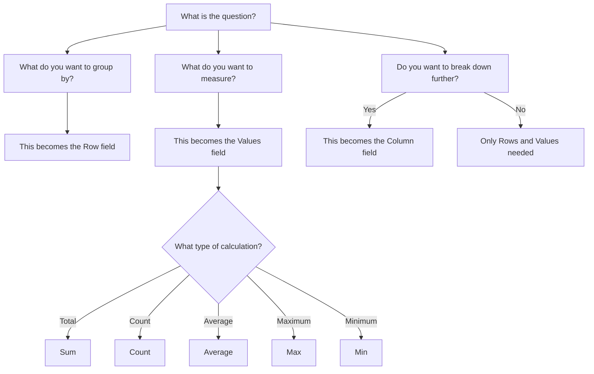

# 1.3.8 Dynamic Graphs and Pivot Tables

> [!abstract] Introduction
> Pivot tables are powerful tools for grouping, summarizing, and analyzing data in spreadsheets and data tables. They allow you to reorganize and aggregate data dynamically, making it easier to identify patterns and insights. When combined with dynamic graphs, pivot tables become an essential tool for exploratory data analysis and reporting.

---

## What is a Pivot Table?

A **pivot table** is a data summarization tool that groups data according to column values. It allows you to reorganize, sort, count, and aggregate data dynamically without altering the original dataset.

### Key Benefits

| Benefit | Description |
| :--- | :--- |
| **Data Grouping** | Organize data by categories, values, or time periods |
| **Summarization** | Calculate sums, averages, counts, and other aggregates |
| **Dynamic Analysis** | Easily change the structure to view data from different perspectives |
| **Pattern Recognition** | Identify trends and outliers quickly |
| **Report Generation** | Create concise summaries for decision-making |

---

## When to Use Pivot Tables

Pivot tables are especially useful when:
- You have **repeated values** that need to be grouped and summarized.
- You need to **analyze data from different perspectives**.
- You want to **calculate aggregates** such as sums, averages, or counts.
- You need to **create summary reports** from large datasets.
- You want to **compare categories** against each other.

---

## Clothing Store Example

> [!example] Scenario: Clothing Inventory Analysis
> A clothing store wants to analyze their inventory to understand which products are selling best, in which sizes, and in which colors.

### Raw Data (Inventory Table)

The store tracks sales with the following columns:

| Transaction ID | Product Type | Color | Size | Price | Quantity Sold | Sales Amount |
| :--- | :--- | :--- | :--- | :--- | :--- | :--- |
| 1 | T-Shirt | Red | M | $20 | 5 | $100 |
| 2 | T-Shirt | Blue | L | $20 | 3 | $60 |
| 3 | Jeans | Blue | 32 | $50 | 2 | $100 |
| 4 | Jeans | Black | 34 | $50 | 4 | $200 |
| 5 | T-Shirt | Red | S | $20 | 6 | $120 |
| 6 | T-Shirt | White | M | $20 | 4 | $80 |
| 7 | Hoodie | Black | L | $40 | 3 | $120 |
| 8 | Hoodie | Gray | M | $40 | 2 | $80 |
| 9 | Jeans | Blue | 32 | $50 | 5 | $250 |
| 10 | T-Shirt | Blue | M | $20 | 7 | $140 |

---

## Pivot Table Examples

### Example 1: Total Sales by Product Type

**Question:** What is the total sales amount for each product type?

**Pivot Table Setup:**
- **Rows:** Product Type
- **Values:** Sum of Sales Amount

| Product Type | Total Sales Amount |
| :--- | :--- |
| Hoodie | $200 |
| Jeans | $550 |
| T-Shirt | $500 |

**Insight:** Jeans generate the highest total sales ($550), followed by T-Shirts ($500).

---

### Example 2: Quantity Sold by Color

**Question:** How many items of each color were sold?

**Pivot Table Setup:**
- **Rows:** Color
- **Values:** Sum of Quantity Sold

| Color | Total Quantity Sold |
| :--- | :--- |
| Black | 7 |
| Blue | 17 |
| Gray | 2 |
| Red | 11 |
| White | 4 |

**Insight:** Blue items sold the most (17), followed by Red (11).

---

### Example 3: Sales by Product Type and Size

**Question:** What are the total sales for each product type broken down by size?

**Pivot Table Setup:**
- **Rows:** Product Type
- **Columns:** Size
- **Values:** Sum of Sales Amount

| Product Type | S | M | L | 32 | 34 | Total |
| :--- | :--- | :--- | :--- | :--- | :--- | :--- |
| Hoodie | - | $80 | $120 | - | - | $200 |
| Jeans | - | - | - | $350 | $200 | $550 |
| T-Shirt | $120 | $320 | $60 | - | - | $500 |

**Insight:** Size M T-Shirts generate the highest sales ($320), while Size 32 Jeans also sell well ($350).

---

### Example 4: Average Price by Product Type

**Question:** What is the average price of each product type?

**Pivot Table Setup:**
- **Rows:** Product Type
- **Values:** Average of Price

| Product Type | Average Price |
| :--- | :--- |
| Hoodie | $40 |
| Jeans | $50 |
| T-Shirt | $20 |

**Insight:** Jeans are the most expensive product type ($50), while T-Shirts are the cheapest ($20).

---

## How to Determine Pivot Table Fields

When creating a pivot table, it is important to determine which fields to use based on the question you want to answer.

### Selecting the Right Fields

| If the Request Is... | The Field Should Be... | And Values Should Be... |
| :--- | :--- | :--- |
| "Show total sales by product type" | Product Type $\rightarrow$ Rows | Sales Amount $\rightarrow$ Values (Sum) |
| "Count of transactions by color" | Color $\rightarrow$ Rows | Transaction ID $\rightarrow$ Values (Count) |
| "Average price by size" | Size $\rightarrow$ Rows | Price $\rightarrow$ Values (Average) |
| "Quantity sold by product type and color" | Product Type $\rightarrow$ Rows, Color $\rightarrow$ Columns | Quantity Sold $\rightarrow$ Values (Sum) |
| "Maximum sales by location" | Location $\rightarrow$ Rows | Sales Amount $\rightarrow$ Values (Max) |
| "Minimum quantity sold by product" | Product $\rightarrow$ Rows | Quantity Sold $\rightarrow$ Values (Min) |

### Decision Flow

## Step-by-Step: Creating a Pivot Table

### Step 1: Select Your Data

Ensure your data is organized in a table format with clear column headers.

### Step 2: Insert Pivot Table

In most spreadsheet applications:

1. Go to **Insert $\rightarrow$ Pivot Table**.
    
2. Select the data range.
    
3. Choose where to place the pivot table (new sheet or existing sheet).
    

### Step 3: Define Rows, Columns, and Values

|**Field Type**|**Purpose**|**Example**|
|---|---|---|
|**Rows**|What you want to group by|Product Type, Color, Size|
|**Columns**|A secondary grouping (optional)|Size, Color, Region|
|**Values**|What you want to calculate|Sales Amount, Quantity Sold|
|**Filters**|To narrow the data (optional)|Date Range, Location|

### Step 4: Choose the Aggregate Function

|**Function**|**Description**|**Example Use**|
|---|---|---|
|**Sum**|Total of values|Total sales by product|
|**Count**|Number of entries|Number of transactions|
|**Average**|Mean of values|Average price by category|
|**Max**|Highest value|Highest sales by region|
|**Min**|Lowest value|Lowest sales by region|

### Step 5: Format and Analyze

- Format the numbers appropriately (currency, percentages, etc.).
    
- Sort the data to highlight top performers.
    
- Add filters to focus on specific data subsets.
    

## Dynamic Graphs from Pivot Tables

Once a pivot table is created, you can generate dynamic graphs (also called PivotCharts) that update automatically when the pivot table data changes.

### Common Chart Types for Pivot Data

|**Chart Type**|**Best For**|**Example**|
|---|---|---|
|**Bar Chart**|Comparing categories|Sales by product type|
|**Column Chart**|Comparing categories vertically|Sales by color|
|**Line Chart**|Trends over time|Monthly sales by product|
|**Pie Chart**|Proportions of a whole|Sales distribution by product type|
|**Stacked Bar**|Comparing sub-categories|Sales by product and size|

## Advanced Pivot Table Techniques

1. **Grouping Data**
    
    - **Dates:** Group by month, quarter, or year.
        
    - **Numbers:** Group into ranges (e.g., Price: $0-20, $21-40, etc.).
        
2. **Calculated Fields**
    
    Add custom calculations that are not directly in the original data.
    
    - _Example:_ Add a "Profit" field if you have "Sales Amount" and "Cost".
        
3. **Show Values As**
    
    Change how values are displayed:
    
    - **% of Grand Total:** Show each value as a percentage of the total.
        
    - **% of Row Total:** Show each value as a percentage of the row total.
        
    - **% of Column Total:** Show each value as a percentage of the column total.
        
4. **Slicers**
    
    Interactive filters that make it easy to filter pivot tables by clicking buttons.
    

## Practice Exercise

> [!example] Clothing Store Analysis
> 
> Using the raw clothing data provided earlier, create pivot tables to answer the following questions:
> 
> 1. Total quantity sold by product type.
>     
> 2. Total sales by color.
>     
> 3. Average price by size.
>     
> 4. Total sales by product type and color.
>     

### Solutions

**1. Total Quantity Sold by Product Type:**

- **Rows:** Product Type
    
- **Values:** Quantity Sold (Sum)
    

|**Product Type**|**Total Quantity Sold**|
|---|---|
|Hoodie|5|
|Jeans|11|
|T-Shirt|25|

**2. Total Sales by Color:**

- **Rows:** Color
    
- **Values:** Sales Amount (Sum)
    

|**Color**|**Total Sales Amount**|
|---|---|
|Black|$320|
|Blue|$550|
|Gray|$80|
|Red|$220|
|White|$80|

**3. Average Price by Size:**

- **Rows:** Size
    
- **Values:** Price (Average)
    

|**Size**|**Average Price**|
|---|---|
|32|$50|
|34|$50|
|L|$30|
|M|$25|
|S|$20|

**4. Total Sales by Product Type and Color:**

- **Rows:** Product Type
    
- **Columns:** Color
    
- **Values:** Sales Amount (Sum)
    

|**Product Type**|**Black**|**Blue**|**Gray**|**Red**|**White**|**Total**|
|---|---|---|---|---|---|---|
|Hoodie|$120|-|$80|-|-|$200|
|Jeans|$200|$350|-|-|-|$550|
|T-Shirt|-|$200|-|$220|$80|$500|

> [!tip] Key Takeaway
> 
> Pivot tables are essential tools for data analysis that allow you to summarize, aggregate, and explore data dynamically. By understanding how to select the right fields, choose appropriate calculations, and create dynamic visualizations, you can gain valuable insights from your data. The key is to always start with a clear question and let that guide your pivot table design.